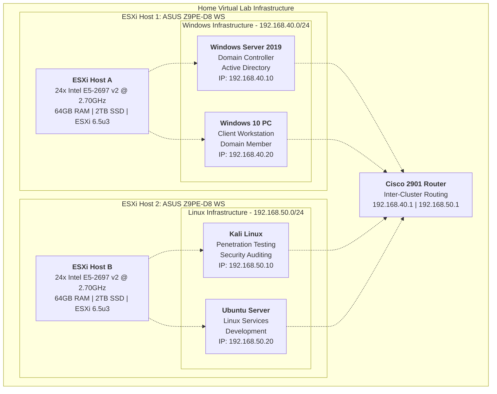

<<<<<<< HEAD
# Home Virtual Lab Infrastructure

A comprehensive home virtual lab environment designed for cybersecurity research, penetration testing, and IT 
infrastructure learning.

## 🏗️ Infrastructure Overview

### Physical Hardware
- **2x ASUS Z9PE-D8 WS Workstations**
  - 24x Intel E5-2697 v2 @ 2.70GHz CPUs per host
  - 64GB RAM per host
  - 2TB SSD storage per host
- **VMware ESXi 6.5u3** hypervisor
- **Cisco 2901 Router** for inter-cluster routing

### Network Architecture


## 🖥️ Virtual Machines

| VM Name | OS | IP Address | Purpose | ESXi Host |
|---------|-----|------------|---------|-----------|
| **lab-dc01** | Windows Server 2019 | 192.168.40.10 | Domain Controller | Host 1 |
| **lab-win10** | Windows 10 Pro | 192.168.40.20 | Client Workstation | Host 1 |
| **lab-kali** | Kali Linux | 192.168.50.10 | Penetration Testing | Host 2 |
| **lab-ubuntu** | Ubuntu Server 22.04 | 192.168.50.20 | Development Server | Host 2 |

## 🌐 Network Configuration

### Cluster A - Windows Infrastructure (192.168.40.0/24)
- **ESXi Host**: Host 1
- **Gateway**: 192.168.40.1 (Cisco 2901)
- **DNS**: 192.168.40.10 (Windows DC)
- **Domain**: homelab.local

### Cluster B - Linux Infrastructure (192.168.50.0/24)
- **ESXi Host**: Host 2
- **Gateway**: 192.168.50.1 (Cisco 2901)
- **DNS**: 192.168.50.20 (Ubuntu Server)
- **Services**: Web, Database, Development

## 🚀 Quick Start

### 1. ESXi Setup
```bash
# Review ESXi configuration guide
cat docs/esxi-setup.md

# Check VM specifications
cat docs/vm-configurations.md

# Review network setup
cat docs/network-config.md
```

### 2. VM Creation
Use vSphere Client to create VMs with specifications in docs/

### 3. Configuration
```bash
# Configure router (copy to device)
configs/cisco-2901/startup-config.txt

# Configure Windows DC (run on VM)
configs/windows-dc/dc-setup.ps1

# Configure Kali Linux (run on VM)
configs/kali-linux/kali-setup.sh

# Configure Ubuntu Server (run on VM)
configs/ubuntu-server/ubuntu-setup.sh
```

## 🧪 Lab Scenarios

- **Penetration Testing**: [labs/penetration-testing/README.md](labs/penetration-testing/README.md)
- **Active Directory**: [labs/active-directory/README.md](labs/active-directory/README.md)
- **Network Security**: [labs/network-security/README.md](labs/network-security/README.md)
- **Web Application Security**: [labs/web-application/README.md](labs/web-application/README.md)

## 📁 Project Structure

```
home-virtual-lab/
├── README.md                  # This file
├── docs/                      # Detailed documentation
├── configs/                   # Configuration files and scripts
├── scripts/                   # Automation and management tools
├── labs/                      # Lab scenarios and exercises
└── assets/                    # Images and diagrams
```

## 🛠️ Management

### ESXi Management
- Use vSphere Client for VM creation and management
- Follow docs/esxi-setup.md for initial configuration
- Check scripts/ directory for automation tools

### Lab Monitoring
```bash
# Network connectivity testing
scripts/automation/connectivity-test.sh

# System monitoring
scripts/monitoring/network-monitor.sh
```

## 🏆 Lab Capabilities

✅ **Enterprise Infrastructure**: ESXi on server hardware  
✅ **Network Segmentation**: Cisco routing with isolated clusters  
✅ **Security Testing**: Complete penetration testing environment  
✅ **Active Directory**: Full Windows domain infrastructure  
✅ **Development Platform**: Modern web and database services  
✅ **Professional Documentation**: Industry-standard documentation  

## 🤝 Contributing

1. Fork the repository
2. Create a feature branch
3. Add improvements or new lab scenarios
4. Submit a pull request

## 📄 License

This project is licensed under the MIT License - see the [LICENSE](LICENSE) file for details.

---

**⚠️ Disclaimer**: This lab is for educational and authorized security research only. Conduct penetration testing 
only on systems you own or have explicit permission to test.
=======
# Virtual-Home-Lab
>>>>>>> fe94a6d9e9e040c863fb36e8450bab7fec18ab75
